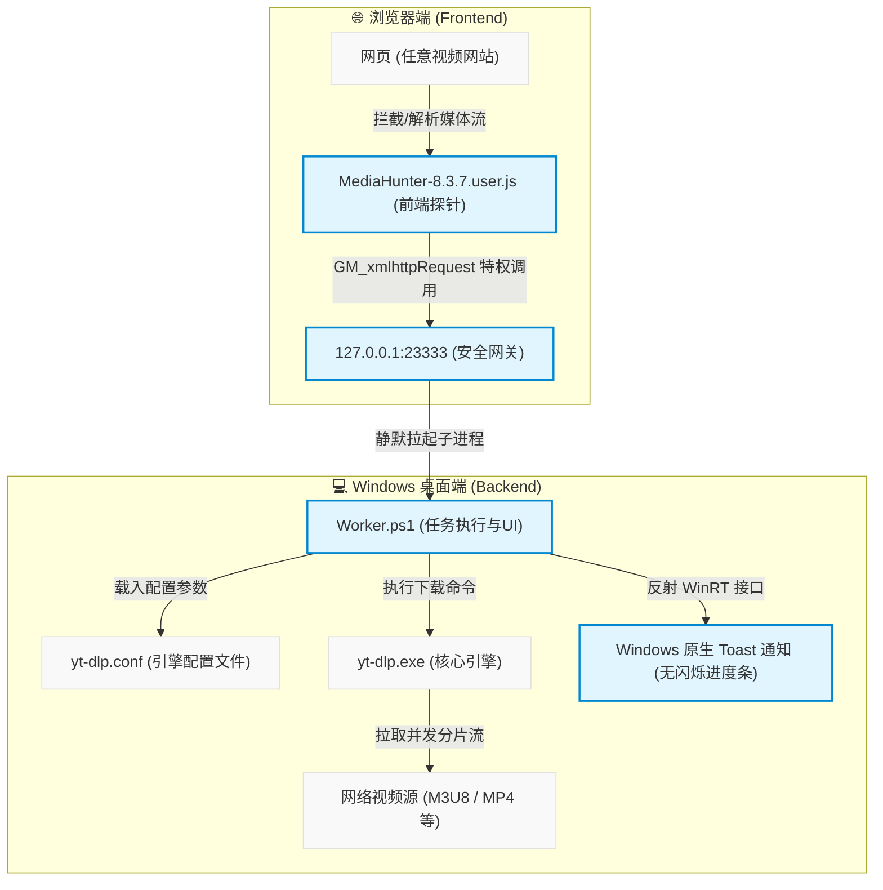

# 🎯 MediaHunter (媒体猎手)


**MediaHunter** 是一个高度优化的“浏览器-本地桌面”联动音视频嗅探与下载系统。它巧妙地将前端浏览器的资源嗅探能力与后端强大的 `yt-dlp` 命令行工具无缝结合，并通过底层的 Windows 原生 Toast API 提供丝滑的下载进度反馈。

> **核心理念：** 拒绝臃肿的 GUI 界面，拒绝浏览器的下载沙盒限制。让极客工具回归“静默、高效、安全、高度可配”的本质。

---

## 📌 目录 (Table of Contents)

1. [⚙️ 系统架构与核心特性 (Architecture & Features)](#1-⚙️-系统架构与核心特性-architecture--features)
2. [🚀 快速上手：安装、部署与运行 (Quick Start)](#2-🚀-快速上手安装部署与运行-quick-start)
3. [⚙️ 核心配置调优指南 (Configuration Guide)](#3-⚙️-核心配置调优指南-configuration-guide)
4. [💡 前端使用与按钮说明 (Usage Guide)](#4-💡-前端使用与按钮说明-usage-guide)
5. [🛠️ 故障排除与日志诊断 (FAQ & Troubleshooting)](#5-🛠️-故障排除与日志诊断-faq--troubleshooting)
6. [📜 免责声明 (Disclaimer)](#6-📜-免责声明-disclaimer)

---

## 1. ⚙️ 系统架构与核心特性 (Architecture & Features)

### 🏗️ 系统生态架构
MediaHunter 采用典型的 **Local API** 架构，由以下五大组件构成完美闭环：



* 🌐 **`MediaHunter-8.3.7.user.js` (前端探针)**：负责网络拦截（XHR/Fetch 重写）、DOM 扫描与媒体解析，并将媒体直链加密发送至本地网关。
* 🚪 **`Server.ps1` (本地安全网关)**：常驻后台的微型 HTTP 服务器（`127.0.0.1:23333`），只接受特定的 POST 任务，拒绝所有外界探针。
* ⚙️ **`Worker.ps1` (下载与 UI 执行器)**：后台隐藏进程，负责接管 `yt-dlp` 命令，挂载输出流并操作原生 Toast 进行进度反馈。
* 🚀 **`StartServer.vbs` (静默启动器)**：以无窗口隐藏模式拉起后端网关，不阻塞前台。
* 📝 **`yt-dlp.conf` (引擎配置文件)**：集中管理底层的下载代理、反爬伪装及分片并发。

### 🛡️ 核心特性
* **无跨域本地网关**：后端网关关闭 CORS 许可，配合油猴特权 `GM_xmlhttpRequest`，切断网页端遭受恶意 CSRF 盲打与端口探测的风险。
* **纯 PS 反射原生通知**：摒弃慢速 C# 动态编译，纯 PowerShell 内存反射操作底层的 WinRT 字典，实现 Toast 通知“秒弹”且局部无频闪刷新。
* **OOM 防溢出与队列控制**：队列机制可避免长视频或下载直播流时间过长造成后台内存泄漏。

### 📊 优势对比 (Feature Comparison)

| 维度 / 特性 | 🌐 传统浏览器扩展 | 🖥️ 传统 GUI 下载器 (如 IDM) | 🎯 MediaHunter (本系统) |
| :--- | :--- | :--- | :--- |
| **反爬突破能力** | 🔴 弱（受限于沙盒，难以突破高强度反爬） | 🟡 中（频繁更新规则，部分网站易失效） | 🟢 极强（基于 `yt-dlp` 强大的 TLS 指纹伪装与请求模拟） |
| **CORS 安全隔离** | 🟡 一般（若暴露本地接口，极易遭受 CSRF） | 🟡 一般（公开 API 易被本地恶意网页滥用） | 🟢 极高（零跨域网关配合油猴特权调用，安全隔离） |
| **前台交互打扰** | 🟢 低（一般静默在扩展栏内） | 🔴 高（频繁弹出下载确认框，打断操作） | 🟢 极低（纯后台静默运行，Windows 原生 Toast 轻量反馈） |
| **Cookie 提取能力**| 🟢 强（在浏览器沙盒内直接提取） | 🔴 弱（常因独占锁/加密数据库导致热读取失败） | 🟢 极强（Firefox 热提取，支持 Chrome/Edge 协作） |
| **长视频/直播录制**| 🔴 极弱（浏览器内存易溢出崩溃，无法长久录制）| 🟡 中（部分支持，但解析和合并效率较差） | 🟢 极强（基于 `yt-dlp` 分片并发下载与流式安全写入） |

---

## 2. 🚀 快速上手：安装、部署与运行 (Quick Start)

为实现流畅的一条龙式部署体验，请按照以下线性步骤依次操作：

> [!TIP]
> **🔥 开箱即用免配置提示**：
> 本项目发布至 GitHub 的 Release 压缩包中，**已默认内置集成了最新的 `ffmpeg.exe`、`ffprobe.exe` 以及免安装的 JavaScript 解密引擎 `deno.exe`**。
> 您只需要直接下载发布包并解压，即可自动获得完整的音视频合并及 YouTube 解密运行能力，**无需再手动下载或配置任何复杂的系统环境变量！**（以下步骤中关于 FFmpeg 和 Deno 的手动下载可作为更新时参考）

### 第一步：创建部署目录与下载文件
在您的电脑中新建一个专属的本地部署文件夹（例如 `D:\MediaHunter\`），并将以下文件悉数放入其中：
1. 项目内的后端核心脚本：`Server.ps1`、`Worker.ps1`、`StartServer.vbs`、`yt-dlp.conf`。
2. 引擎可执行程序：下载最新版 [yt-dlp](https://github.com/yt-dlp/yt-dlp/releases) 并重命名为 **`yt-dlp.exe`** 放入该目录下。
3. 如果您下载的是内置包，请确保 `ffmpeg.exe`、`ffprobe.exe` 与 `deno.exe` 已解压存放在该同级目录中。
4. （可选）自定义通知图标：`icon.png` 放入同目录下。

### 第二步：配置前置环境与依赖（手动更新/自定义时参考）
MediaHunter 后端依赖以下两项外部能力，您可以选择直接使用包内自带的二进制文件，也可以单独更新和配置：

#### 1. 音视频合并器 (FFmpeg - 必选)
高画质在线视频通常为音视频轨道分离格式，`yt-dlp` 必须依赖 `FFmpeg` 进行合并封装。
* **🟢 免安装绿色部署 (推荐)**：直接将 `ffmpeg.exe` 与 `ffprobe.exe` 放入部署目录 `D:\MediaHunter\`（即与 `yt-dlp.exe` 处于同一文件夹内）即可，`yt-dlp` 会自动识别并优先调用同目录下的合并引擎。如需单独下载最新版本，可前往 [gyan.dev FFmpeg](https://www.gyan.dev/ffmpeg/builds/) 下载 `ffmpeg-git-essentials.7z`。
* **🛠️ 全局环境变量配置**：解压 FFmpeg，并将其 `bin` 目录路径手动配置进 Windows 系统环境变量 `Path` 中。

#### 2. JavaScript 解密引擎 (Node.js 或 Deno - 可选)
在下载 YouTube 或国内部分具有加密混淆算法的站点时，`yt-dlp` 需要在本地执行解密 JS 代码。
* **🟢 免安装绿色部署 (推荐)**：直接将 **`deno.exe` 放入 `D:\MediaHunter\`（与 `yt-dlp.exe` 处于同级目录）**。`yt-dlp` 将自动识别 `deno` 引擎，免去安装 Node.js 的烦恼。如需单独下载，可从 [Deno 官网](https://deno.com/) 获取。
* **🛠️ 全局常规安装**：在本地常规下载并安装全局 [Node.js](https://nodejs.org/) 运行环境。

> 💡 *提示：为了方便在本地任意命令行（CMD/PowerShell）中调试极客工具，建议也将 `D:\MediaHunter\` 这一文件夹路径也一并添加进系统环境变量 `Path` 中。*

### 第三步：后台服务运行与状态管理
部署好文件后，您可以使用以下方式启动和控制您的本地网关服务：
* **🟢 后台静默启动**：直接双击部署目录下的 `StartServer.vbs`。网关进程将静默常驻在后台，并自动开启对 `127.0.0.1:23333` 的监听（无黑框，不干扰前台操作）。
* **🔍 验证运行状态**：若要确认网关是否正常工作，可随时打开 **PowerShell** 窗口，并执行以下命令：
  ```powershell
  Get-Process -Name powershell | Where-Object { $_.CommandLine -like "*Server.ps1*" }
  ```
  *终端若成功输出含有 `powershell` 的运行数据，说明网关运行良好。*
* **🔴 一键停止服务**：若需完全停用并退出本后台网关，在 **PowerShell** 中执行以下命令：
  ```powershell
  Get-Process -Name powershell | Where-Object { $_.CommandLine -like "*Server.ps1*" } | Stop-Process -Force
  ```
  *此命令只会精准停止本系统的 Server 网关进程，绝不影响其他正常运行的 PowerShell 窗口。*
* **🚀 配置开机自启 (推荐)**：
  1. 右键点击 `StartServer.vbs` -> 创建快捷方式。
  2. 按 `Win + R` 键，输入 `shell:startup` 回车打开 Windows 启动文件夹。
  3. 将刚才创建的快捷方式剪切并粘贴至该文件夹下，后续系统开机即会自动静默启动网关。

### 第四步：启用前端探针
1. 确保您的浏览器安装有 [Tampermonkey](https://www.tampermonkey.net/) 插件。
2. 在 Tampermonkey 中点击“添加新脚本”，将项目中的 `MediaHunter-8.3.7.user.js` 全部代码复制粘贴并保存。
3. 打开任意视频网站，若网页右下角出现优雅亮眼的紫色 **「媒体猎手」** 悬浮按钮，说明部署已圆满成功！

---

## 3. ⚙️ 核心配置调优指南 (Configuration Guide)

所有的下载行为、保存路径、网络代理及多浏览器适配参数，均统一存放在 **`yt-dlp.conf`** 配置文件中。使用记事本打开该文件，您可以集中完成以下所有调优设置：

### 🟢 基础配置调整 (小白用户必看)
1. **自定义下载保存路径**：
   找到并编辑 `--paths` 属性，将其修改为您电脑上真实存在的目录。
   ```text
   --paths "temp:D:\Temp\Cache"   # 临时缓存目录
   --paths "home:D:\Downloads"    # 最终下载完毕的保存目录
   ```
2. **修改或关闭代理设置**：
   若无科学上网，或者代理端口不是 `10808`，请修改该配置，或者直接在行首添加 `#` 注释掉该行：
   ```text
   #--proxy "socks5://127.0.0.1:10808"
   ```

### 💻 适配不同的主流浏览器（Cookie 与安全指纹替换）
现代 Chromium 浏览器（Chrome / Edge）由于其严格的 DPAPI 级本地加密与独占锁，容易造成 Cookie 提取失败。因而本项目默认优先适配机制更为开放的 **Firefox**。
如果您倾向于使用 Chrome 或 Edge 作为获取 Cookie 与登录状态的主力浏览器，请在 `yt-dlp.conf` 中依照下表对参数进行全局对应替换：

| 原始配置参数 (Firefox) | 替换为 Chrome 对应参数 | 替换为 Edge 对应参数 | 参数说明 |
| :--- | :--- | :--- | :--- |
| `--cookies-from-browser firefox` | `--cookies-from-browser chrome` | `--cookies-from-browser edge` | 从对应浏览器自动读取特定站点的 Cookie 登录凭证 |
| `--impersonate "firefox"` | `--impersonate "chrome"` | `--impersonate "edge"` | 伪装底层 TLS 和 HTTP/2 网络指纹以防被高防防火墙封锁 |
| `--user-agent "Mozilla/5.0 ..."` | *(更换为您本地 the Chrome UA)* | *(更换为您本地 the Edge UA)* | 保证 User-Agent 伪装头与 Cookie 来源浏览器型号和版本保持一致 |

### 🔴 高级极客参数定制
针对有经验的用户，配置文件中预留了强大的反爬与性能参数：
* `--concurrent-fragments 6`：开启 6 线程并发下载 M3U8/MPD 视频分片，极大限度跑满带宽。
* `--add-header`：注入原生浏览器的 `Sec-Fetch-*` 跨域请求头，完美模拟人类真实访问。

> [!WARNING]
> `--cookies-from-browser`、`--impersonate`、`--user-agent`、`--add-header` 等参数存在极强的联动关系。如非必要，切勿随意修改或混用，以免因请求指纹冲突而被目标网站拦截。

---

## 4. 💡 前端使用与按钮说明 (Usage Guide)

当在网页中成功嗅探到媒体资源后，点击右下角 **「媒体猎手」** 展开资源卡片列表，每个视频卡片均集成了以下三个核心交互动作：

### 1. 📋 复制直链 (Copy Link)
* **普通单击**：
  直接将视频的真实流媒体直链 URL 复制到您的剪贴板。适合复制到迅雷、Aria2 或手机端运行的其他第三方播放器中直接播放与调用。

### 2. 💻 复制本地调试命令 (Alt + Copy Command)
* **Alt + 单击**：
  *高级极客调试/脱机下载模式*。系统将自动侦测该视频的上下文安全限制，包含标题、Referer 跨域防盗链头、Origin 伪装头，自动组装为一条**符合命令行规范的完整本地 `yt-dlp` 下载命令**并复制到您的剪贴板。
  * **命令示例**：
    `yt-dlp "VIDEO_URL" --referer "PAGE_URL" --add-header "Origin: ORIGIN" --trim-filenames 200 -o "TITLE.mp4"`
  * 您只需在命令行窗口中直接 `Ctrl + V` 粘贴并回车，即可在终端中享受到带防盗链伪装的极速下载。

### 3. 📥 异步后台静默下载 (Backend Download)
* **普通单击**：
  点击后，脚本将任务异步投递给本地 API 极客网关。后台 `Worker.ps1` 会自动在隐藏窗口中接管下载。整个下载期间，Windows 右下角弹出的原生通知会提供**高帧率无频闪的局部进度条刷新**。下载成功后，卡片自动收回，不占用前台任何前台窗口。

---

## 5. 🛠️ 故障排除与日志诊断 (FAQ & Troubleshooting)

### Q1：点击下载按钮后，Windows 右下角弹出“下载失败”提示，该如何排查？
请移步至您的部署目录中的 `logs/` 子文件夹，用记事本打开最新的 `yt-dlp_error_[时间戳]_[UUID].log` 日志文件，查看末尾的 traceback：
* **含有 `Errno 2: No such file or directory`**：
  说明 `yt-dlp.conf` 中配置的缓存或保存路径 `--paths` 在您的硬盘上不存在。请前往修改或在电脑上新建这两个文件夹。
* **含有 `Failed to establish a new connection`**：
  说明代理配置不通。如果不需要代理，请在 `yt-dlp.conf` 中用 `#` 屏蔽掉 `--proxy`，或者确认您的代理客户端端口配置一致。
* **含有 `Sign in to confirm your age` 或 `HTTP Error 403: Forbidden`**：
  您的 Cookie 来源或登录态配置失效了。请先在对应浏览器登录该网站，并确认 `yt-dlp.conf` 中的 `--cookies-from-browser` 指向正确的浏览器。
* **含有 `FFmpeg not found`**：
  `yt-dlp` 无法定位 FFmpeg 音视频合并核心。请确保 `ffmpeg.exe` 已经复制到了部署目录下（`D:\MediaHunter\`），或者正确将其所在目录放到了环境变量中。
* **含有 `ExtractorError`**：
  JS 解密异常。请检查您是否在本地部署了全局 Node.js 环境，或者是否已将极客免安装的 `deno.exe` 成功放置在与 `yt-dlp.exe` 同一目录下。

### Q2：启动时日志或控制台提示“Server failed to start. Port might be in use.”？
* **原因**：本地的 `23333` 端口被其他软件占用，或者之前启动的 `Server.ps1` 未能正常退出，导致网关锁死。
* **解决办法**：请按照 [一键停止服务](#-一键停止服务) 的命令杀掉常驻后台进程，然后再重新双击 `StartServer.vbs` 运行。

---

## 6. 📜 免责声明 (Disclaimer)

本项目仅供网络技术学习、防盗链机制研究及本地系统 API 调用测试使用。请遵守当地法律法规及目标网站的服务条款，严禁使用本工具下载或传播未经授权的版权内容。

---

*Created with ❤️ by yudong2ao & Gemini*